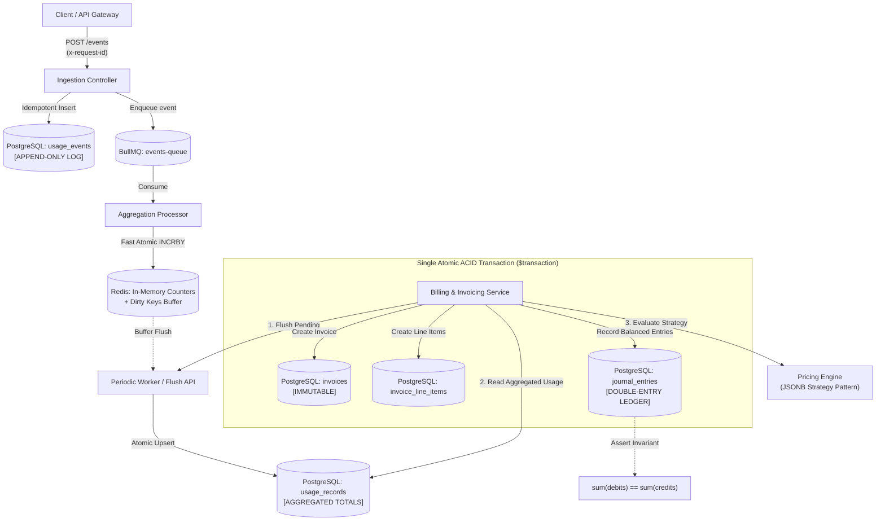

# MeterFlow

### High-Throughput Usage-Based Billing & Metering Engine

[]()
[]()
[]()
[]()
[]()
[]()
[%20%3D%3D%20%CE%A3(Credits)-purple.svg)]()

**MeterFlow** is a high-throughput, financially accurate usage metering and subscription billing engine built as a modular monolith in TypeScript and NestJS. Engineered with zero floating-point arithmetic, database-level idempotency, hybrid in-memory counter tiering, pluggable strategy-based dynamic pricing, immutable invoice finalization, and an atomic double-entry accounting ledger.

---

## 🏛️ System Architecture



---

## 🛡️ The 6 Non-Negotiables (Financial & Architectural Invariants)

| # | Invariant Guarantee | Implementation & Verification | Code Location |
|---|---|---|---|
| **1** | **Zero Floating-Point Money or Quantities** | All currency is calculated and stored strictly as **integer cents** (`BigInt`/`Int`). No IEEE 754 float drift occurs anywhere in the pipeline. | [`src/pricing/`](file:///Users/ayoola/Dev/Usage-Based%20Billing%20&%20Metering%20Engine/src/pricing/) & [`prisma/schema.prisma`](file:///Users/ayoola/Dev/Usage-Based%20Billing%20&%20Metering%20Engine/prisma/schema.prisma) |
| **2** | **Append-Only Raw Usage Event Log** | The `usage_events` table is strictly append-only. Zero `UPDATE` or `DELETE` operations exist in the codebase. Retains a permanent, tamper-evident audit log. | [`src/ingestion/ingestion.service.ts`](file:///Users/ayoola/Dev/Usage-Based%20Billing%20&%20Metering%20Engine/src/ingestion/ingestion.service.ts) |
| **3** | **Finalized Invoice Immutability** | Invoices marked `FINALIZED` cannot be modified in-place. Any mutation attempt triggers `403 Forbidden`. Corrections require new invoices/credit notes. | [`src/billing/billing.service.ts`](file:///Users/ayoola/Dev/Usage-Based%20Billing%20&%20Metering%20Engine/src/billing/billing.service.ts) |
| **4** | **Balanced Double-Entry Ledger** | Every finalized invoice writes matching Debits (`ACCOUNTS_RECEIVABLE`) and Credits (`USAGE_REVENUE`/`SUBSCRIPTION_REVENUE`). `sum(debits) == sum(credits)` holds on every write. | [`src/ledger/ledger.service.ts`](file:///Users/ayoola/Dev/Usage-Based%20Billing%20&%20Metering%20Engine/src/ledger/ledger.service.ts) |
| **5** | **Database-Enforced Idempotency** | Event deduplication enforced via PostgreSQL `@unique` constraint on `event_id`. Returns `202 Accepted` on new events and `200 OK` on duplicates without double-counting. | [`src/ingestion/ingestion.service.ts`](file:///Users/ayoola/Dev/Usage-Based%20Billing%20&%20Metering%20Engine/src/ingestion/ingestion.service.ts) |
| **6** | **Config-Driven Dynamic Pricing** | Pricing models (flat fees, free allowances, per-unit rates, tiered graduated, volume) live in versioned JSONB schemas (`plans.pricing_config`), updatable with zero redeploys. | [`src/pricing/strategies/`](file:///Users/ayoola/Dev/Usage-Based%20Billing%20&%20Metering%20Engine/src/pricing/strategies/) & [`src/plans/`](file:///Users/ayoola/Dev/Usage-Based%20Billing%20&%20Metering%20Engine/src/plans/) |

---

## ⚡ Key Highlights & Engineering Rigor

- **Hybrid In-Memory Aggregation Tier**: High-throughput hot path uses atomic Redis `INCRBY` counters with dirty-key sets (`usage:dirty_keys`). Periodic worker flushes deltas to PostgreSQL `usage_records` with resilient fallback if Redis is unavailable.
- **Out-of-Order & Late Event Attribution**: Deterministic billing period windows are computed from the event's `timestamp`, not receipt time.
- **Single-Transaction Finalization**: Generating an invoice, inserting line items, and writing balanced ledger entries executes inside an atomic `prisma.$transaction`.
- **Property-Based Testing (`fast-check`)**: Verified mathematical pricing monotonicity (`cost(q+1) >= cost(q)`), non-negativity, float prevention, and ledger balancing over 4,000+ randomized permutations.
- **Concurrency Hardening**: Zero lost updates under 50 concurrent parallel ingestion requests, and atomic duplicate storm suppression under 20 parallel duplicate requests.
- **Distributed Tracing & Structured Logging**: Contextual `x-request-id` header propagation and structured JSON log telemetry on all HTTP lifecycles.

---

## 🚀 Quickstart

### Prerequisites
- Node.js &gt;= 18
- Docker & Docker Compose

### 1. Clone & Start Dependencies
```bash
git clone https://github.com/donaina/MeterFlow.git
cd MeterFlow

# Copy environment variables
cp .env.example .env

# Boot PostgreSQL 16 & Redis 7 via Docker Compose
docker compose up -d
```

### 2. Install & Run Migrations
```bash
npm install
npx prisma migrate dev
```

### 3. Start the Application
```bash
# Development mode
npm run start:dev

# Production build & run
npm run build
node dist/main.js
```
The server will start at `http://localhost:3000`.

---

## 📖 OpenAPI / Swagger Documentation

Interactive OpenAPI documentation with schema definitions, request bodies, and response codes is available at:
👉 **`http://localhost:3000/api/docs`**

---

## 🧪 Testing

```bash
# Run all unit tests & fast-check property-based tests (35 tests)
npm test

# Run all end-to-end integration & concurrency stress suites (21 tests)
npm run test:e2e

# Run test coverage
npm run test:cov
```

### Test Suite Breakdown:
- `src/pricing/pricing.property.spec.ts`: Fast-check property-based testing of pricing monotonicity, allowance invariants, and float prevention.
- `test/concurrency-stress.e2e-spec.ts`: Parallel burst ingestion (lost-update prevention) & duplicate event storms.
- `test/invoicing.e2e-spec.ts`: Full simulated month of usage &rarr; invoice &rarr; balanced double-entry ledger audit.
- `test/pricing.e2e-spec.ts`: Plan versioning, line item breakdowns, and zero-redeploy pricing updates.
- `test/aggregation.e2e-spec.ts`: Hybrid Redis buffering, period calculations, and out-of-order event attribution.
- `test/ingestion.e2e-spec.ts`: Input boundary validation, duplicate suppression, and append-only constraints.

---

## 🎬 Live Interactive Demo

Run the automated, color-coded walkthrough script demonstrating all 6 Non-Negotiables in action:

```bash
chmod +x scripts/demo.sh
./scripts/demo.sh
```

### Or Explore via Postman:
Import `postman_collection.json` into Postman to test all endpoints interactively.

---

## 📡 API Reference & Core Endpoints

### 1. Ingest Usage Event (Idempotent)
```http
POST /events
Content-Type: application/json
x-request-id: 9a7b1c2d-1234-5678-9abc-def012345678
```
```json
{
  "event_id": "evt_zap_88991122",
  "customer_id": "cust_acme_corp",
  "feature_key": "zap_tasks",
  "quantity": 150,
  "timestamp": "2026-08-15T12:00:00.000Z",
  "metadata": { "workflow_id": "wf_order_sync", "region": "us-east" }
}
```
**Responses:**
- `202 Accepted`: New event recorded and queued for aggregation.
- `200 OK`: Duplicate `event_id` detected and suppressed (idempotent).

---

### 2. Create / Update Pricing Plan (JSONB Config-Driven)
```http
POST /plans
Content-Type: application/json
```
```json
{
  "name": "Scale Tier",
  "pricing_config": {
    "flat_fee": { "amount_cents": 4900, "description": "Base Monthly Platform Fee" },
    "rules": [
      {
        "feature_key": "zap_tasks",
        "type": "tiered_graduated",
        "config": {
          "description": "Graduated Task Execution",
          "tiers": [
            { "from": 0, "to": 1000, "rate_cents": 0 },
            { "from": 1000, "to": 5000, "rate_cents": 5 },
            { "from": 5000, "to": null, "rate_cents": 2 }
          ]
        }
      },
      {
        "feature_key": "storage_gb",
        "type": "per_unit",
        "config": {
          "description": "Storage Volume",
          "rate_cents": 10,
          "free_allowance": 20
        }
      }
    ]
  }
}
```

---

### 3. Generate & Finalize Immutable Invoice
```http
POST /invoices/generate
Content-Type: application/json
```
```json
{
  "customer_id": "cust_acme_corp",
  "period_start": "2026-08-01T00:00:00.000Z",
  "period_end": "2026-08-31T23:59:59.999Z"
}
```
**Response (`201 Created`):**
```json
{
  "id": "c4d3e2f1-0000-4444-8888-abcdef123456",
  "invoiceNumber": "INV-202608-K9YNE",
  "customerId": "cust_acme_corp",
  "subtotalCents": 17900,
  "totalCents": 17900,
  "status": "FINALIZED",
  "lineItems": [
    { "description": "Base Monthly Platform Fee", "quantity": 1, "amountCents": 4900 },
    { "featureKey": "zap_tasks", "description": "Graduated Task Execution", "quantity": 3500, "amountCents": 12500 },
    { "featureKey": "storage_gb", "description": "Storage Volume", "quantity": 60, "amountCents": 400 }
  ],
  "journalEntries": [
    { "entryType": "DEBIT", "account": "ACCOUNTS_RECEIVABLE", "amountCents": 17900 },
    { "entryType": "CREDIT", "account": "SUBSCRIPTION_REVENUE", "amountCents": 4900 },
    { "entryType": "CREDIT", "account": "USAGE_REVENUE", "amountCents": 12500 },
    { "entryType": "CREDIT", "account": "USAGE_REVENUE", "amountCents": 400 }
  ]
}
```

---

### 4. Double-Entry Ledger Invariant Verification
```http
GET /ledger/summary
```
**Response (`200 OK`):**
```json
{
  "totalDebitsCents": 17900,
  "totalCreditsCents": 17900,
  "isBalanced": true,
  "entriesCount": 4
}
```

---

## 🏛️ Architectural Decision Records (ADRs)

Key architectural decisions are documented in detail in [DECISIONS.md](file:///Users/ayoola/Dev/Usage-Based%20Billing%20&%20Metering%20Engine/DECISIONS.md):
- **ADR-001**: Architecture Style — Modular Monolith
- **ADR-002**: Financial Correctness — Double-Entry Ledger & Integer Money
- **ADR-003**: Storage & Ingestion Tiering — PostgreSQL + Redis & BullMQ
- **ADR-004**: Config-Driven Pricing Engine via JSONB and Strategy Pattern
- **ADR-005**: Database-Enforced Idempotency & Append-Only Usage Log
- **ADR-006**: Hybrid In-Memory Counter with Durable Periodic Flush & Fallback
- **ADR-007**: Strategy Pattern for Dynamic JSONB Pricing Rules & Plan Versioning
- **ADR-008**: Immutable Finalized Invoicing and Atomic Double-Entry Ledger
- **ADR-009**: Production Hardening, Invariant Property-Based Testing, and Structured Tracing

---

## 📄 License
MIT License
